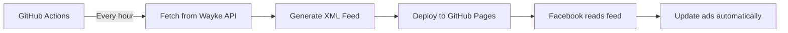

# 🚗 Göinge Bil Facebook Dynamic Ads Feed

Automatically sync vehicle inventory to Facebook/Meta for Dynamic Automotive Advertising.

[](https://github.com/YOUR_USERNAME/goingebil-facebook-feed/actions/workflows/update-feed.yml)

---

## 📊 Live Feed

**Feed URL**: `https://YOUR_USERNAME.github.io/goingebil-facebook-feed/feed.xml`

**Status Page**: `https://YOUR_USERNAME.github.io/goingebil-facebook-feed/`

*(Replace YOUR_USERNAME with your actual GitHub username)*

---

## ✨ Features

- ✅ **Auto-updates** every hour from Wayke API
- ✅ **119+ vehicles** from all Göinge Bil locations
- ✅ **Facebook compliant** XML format
- ✅ **100% free** hosting on GitHub Pages
- ✅ **No server** required
- ✅ **Zero maintenance** - runs automatically

---

## 🚀 Quick Start

**See [SETUP_GUIDE.md](SETUP_GUIDE.md) for complete instructions**

### TLDR

1. Fork/clone this repository
2. Enable GitHub Actions
3. Enable GitHub Pages (deploy from `gh-pages` branch)
4. Use `https://YOUR_USERNAME.github.io/goingebil-facebook-feed/feed.xml` in Facebook

---

## 📁 File Structure

```
.
├── .github/
│   └── workflows/
│       └── update-feed.yml      # GitHub Actions workflow (runs hourly)
├── generate-feed.js             # Feed generation script
├── package.json                 # Node.js dependencies
├── .gitignore                   # Git ignore file
├── SETUP_GUIDE.md              # Detailed setup instructions
└── README.md                    # This file
```

---

## 🔄 How It Works



1. **GitHub Actions** runs every hour (configurable)
2. Fetches latest vehicles from **Wayke API**
3. Transforms data to **Facebook XML format**
4. Commits to `gh-pages` branch
5. **GitHub Pages** serves the XML
6. **Facebook** reads and updates catalog

---

## 📊 Data Source

**API**: Wayke Vehicle API
**Endpoint**: `https://api.wayke.se/vehicles?hits=200`
**Format**: JSON → XML transformation

### Included Data

- ✅ Vehicle ID, Make, Model, Year
- ✅ Price, Mileage, Transmission
- ✅ Fuel type, Body style
- ✅ High-quality images
- ✅ Location, Registration plate
- ✅ Equipment level, Description

---

## ⚙️ Configuration

### Change Update Frequency

Edit `.github/workflows/update-feed.yml`:

```yaml
schedule:
  - cron: '0 * * * *'    # Every hour (default)
  # - cron: '*/30 * * * *'  # Every 30 minutes
  # - cron: '0 */6 * * *'   # Every 6 hours
```

### Manual Trigger

Go to **Actions** → **Update Facebook Feed** → **Run workflow**

---

## 🛠️ Local Development

### Requirements

- Node.js 18+

### Setup

```bash
# Clone repository
git clone https://github.com/YOUR_USERNAME/goingebil-facebook-feed.git
cd goingebil-facebook-feed

# Install dependencies
npm install

# Generate feed locally
npm run generate

# Check output
cat output/feed.xml
```

---

## 📈 Monitoring

### Workflow Status

Check GitHub Actions tab for:
- ✅ Green = Success
- ❌ Red = Failed (check logs)
- 🟡 Yellow = Running

### Feed Status

Visit your status page:
```
https://YOUR_USERNAME.github.io/goingebil-facebook-feed/
```

Shows:
- Last update time
- Number of vehicles
- Feed URL
- Quick links

---

## 🔍 Troubleshooting

### Workflow failing?

1. Check Actions tab for error logs
2. Verify Wayke API is accessible
3. Check workflow permissions in Settings → Actions

### Feed not updating in Facebook?

1. Verify feed URL is accessible
2. Check Facebook Commerce Manager diagnostics
3. Ensure feed refresh is set to hourly

### No vehicles showing?

1. Open feed XML in browser
2. Verify `<listing>` tags are present
3. Check Wayke API response

---

## 💰 Cost

**$0 Forever**

GitHub Free Tier includes:
- ✅ 2,000 Actions minutes/month (uses ~1 min/day)
- ✅ 100GB Pages bandwidth/month
- ✅ Unlimited public repositories

You'll never exceed these limits! ✅

---

## 📊 Performance

- **Update frequency**: Every hour
- **Execution time**: ~10-30 seconds
- **Feed size**: ~100-150 KB (119 vehicles)
- **Bandwidth**: < 1 MB/day
- **API calls**: 24/day (well within limits)

---

## 🔐 Security

- ✅ Public API (no authentication needed)
- ✅ Read-only operations
- ✅ No sensitive data exposed
- ✅ HTTPS only
- ✅ No secrets required

---

## 📝 Facebook Setup

After your feed is live:

1. **Create Catalog**
   - Go to Facebook Commerce Manager
   - Create new Vehicles catalog
   - Name: "Göinge Bil Inventory"

2. **Add Data Source**
   - Type: Scheduled Feed
   - URL: Your GitHub Pages feed URL
   - Frequency: Every 1 hour
   - Currency: SEK

3. **Create Campaign**
   - Type: Advantage+ catalog ads
   - Select your catalog
   - Target audience
   - Launch!

---

## 🎯 Next Steps

1. ✅ Feed is live
2. ⬜ Add to Facebook Commerce Manager
3. ⬜ Install Meta Pixel on website
4. ⬜ Create first ad campaign
5. ⬜ Set up product sets
6. ⬜ Monitor performance

---

## 📚 Resources

- [Facebook Automotive Ads Guide](https://www.facebook.com/business/help/120325381656392)
- [GitHub Actions Documentation](https://docs.github.com/en/actions)
- [GitHub Pages Documentation](https://docs.github.com/en/pages)
- [Wayke API Documentation](https://api.wayke.se)

---

## 📞 Support

### Issues with this feed?
Open an issue in this repository

### Facebook Ads support?
[Facebook Business Support](https://www.facebook.com/business/help)

### Wayke API issues?
Check [api.wayke.se](https://api.wayke.se) status

---

## 📜 License

MIT License - Free to use and modify

---

## 🙏 Credits

- **Vehicle Data**: Wayke API
- **Hosting**: GitHub Pages
- **Automation**: GitHub Actions
- **Made for**: Göinge Bil

---

**⭐ Star this repo if it helps you!**

---

**Last updated**: Auto-generated every hour by GitHub Actions
